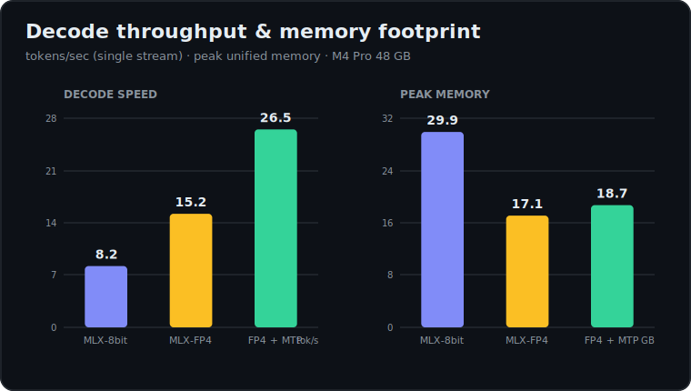
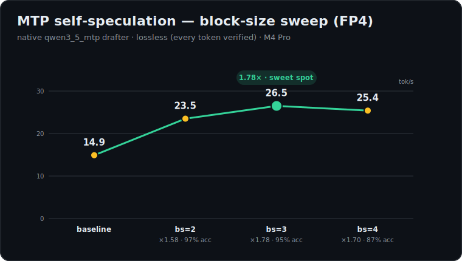
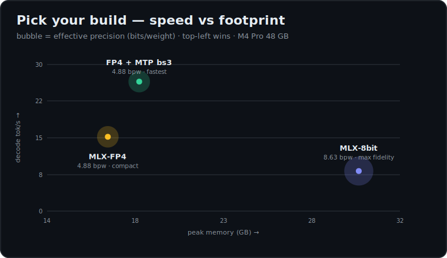
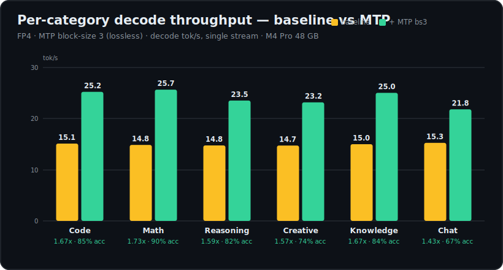
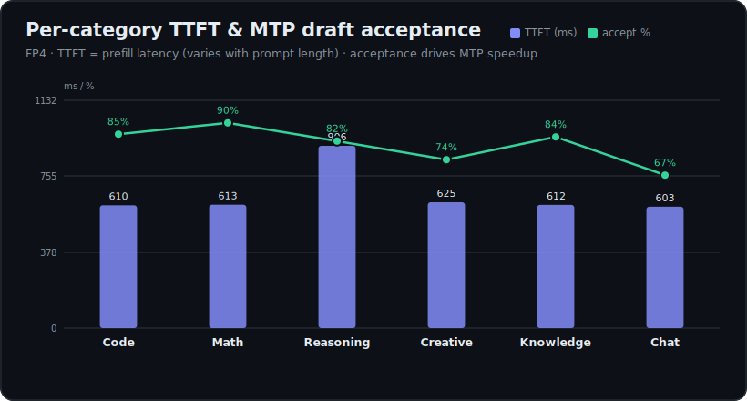

# Qwen3.6-27B-AEON-Ultimate-Uncensored — MLX (Apple Silicon · Metal)

[](https://huggingface.co/AEON-7/Qwen3.6-27B-AEON-Ultimate-Uncensored-Multimodal-MLX-8bit)
[](https://huggingface.co/AEON-7/Qwen3.6-27B-AEON-Ultimate-Uncensored-Multimodal-MLX-FP4)
[](https://huggingface.co/AEON-7/Qwen3.6-27B-AEON-Ultimate-Uncensored-MLX-MTP-Drafter)
[](https://huggingface.co/Qwen)
[](https://developer.apple.com/metal/)

> **The Apple-Silicon member of the Qwen3.6-27B-AEON family.** Two native MLX builds of [`AEON-7/Qwen3.6-27B-AEON-Ultimate-Uncensored-BF16`](https://huggingface.co/AEON-7/Qwen3.6-27B-AEON-Ultimate-Uncensored-BF16) — a **fidelity flagship** ([`MLX-8bit`](https://huggingface.co/AEON-7/Qwen3.6-27B-AEON-Ultimate-Uncensored-Multimodal-MLX-8bit), 29.5 GB) and a **compact/fast** build ([`MLX-FP4`](https://huggingface.co/AEON-7/Qwen3.6-27B-AEON-Ultimate-Uncensored-Multimodal-MLX-FP4), 16 GB) — plus a native [`MTP drafter`](https://huggingface.co/AEON-7/Qwen3.6-27B-AEON-Ultimate-Uncensored-MLX-MTP-Drafter) that delivers **up to 1.78× lossless self-speculation** (every token verified; 1.4–1.7× typical across prompt categories). Selective quantization that keeps the Gated-DeltaNet/SSM dynamics, the vision tower, and the MTP head in BF16 — quantized and adversarially validated on a **MacBook Pro · M4 Pro · 48 GB**.
>
> This is the on-device member of an existing model family. For other accelerators: the **NVIDIA NVFP4 + MTP** sibling [`…-Multimodal-NVFP4-MTP-XS`](https://huggingface.co/AEON-7/Qwen3.6-27B-AEON-Ultimate-Uncensored-Multimodal-NVFP4-MTP-XS) (Blackwell / DGX Spark) and the **DFlash** vLLM sibling [`…-DFlash`](https://github.com/AEON-7/Qwen3.6-27B-AEON-Ultimate-Uncensored-DFlash) (A100 / H100). The BF16 source is [`…-BF16`](https://huggingface.co/AEON-7/Qwen3.6-27B-AEON-Ultimate-Uncensored-BF16).



## ⚡ Quickstart (Apple Silicon)

**0 → running on a fresh Mac** (no Python, no tools needed) — [`uv`](https://docs.astral.sh/uv/) installs a correct Python + the deps for you. This model needs the **`qwen3_5_vision`** tower, which is merged on **mlx-vlm `main`** but **not** in 0.6.1 — so the quickstart pins git main (guaranteed to work). Once a PyPI release includes it, plain `mlx-vlm` works too.

```bash
curl -LsSf https://astral.sh/uv/install.sh | sh && source $HOME/.local/bin/env   # one-time: install uv

# serve FP4 + MTP self-speculation (recommended default — up to 1.78× lossless).
# uv fetches Python 3.12 + mlx-vlm(main) on first run. --model and --draft-model are HF repo ids,
# so mlx-vlm pulls BOTH the 16 GB model and the 821 MB MTP drafter automatically on first run.
uv run --python 3.12 --with "mlx-vlm @ git+https://github.com/Blaizzy/mlx-vlm" -- \
  python -m mlx_vlm.server --model AEON-7/Qwen3.6-27B-AEON-Ultimate-Uncensored-Multimodal-MLX-FP4 \
  --draft-model AEON-7/Qwen3.6-27B-AEON-Ultimate-Uncensored-MLX-MTP-Drafter --draft-kind mtp --draft-block-size 3 \
  --port 8080 --trust-remote-code
```

`--draft-block-size 3` is the benchmarked sweet spot; MTP is **lossless** (every drafted token is verified, so output is identical to no-MTP, just faster). Swap in the **`…-MLX-8bit`** repo id for max fidelity. *(Pre-fetch the drafter explicitly if you like: `hf download AEON-7/Qwen3.6-27B-AEON-Ultimate-Uncensored-MLX-MTP-Drafter`.)*

Call it like an OpenAI endpoint (`POST http://localhost:8080/v1/chat/completions`) with the request `"model"` set to the launched id. *(While a repo is private, run `hf auth login` first — or pass a local `--model` path.)*

**Sampling — set `temperature: 1.0`.** The MLX server defaults to *greedy* decoding (`temperature 0`), which can loop on long prompts. This model is tuned for **`temperature 1.0`** (`top_p 0.95`, `top_k ~64`). Pass it in **every** request — clients that send no sampling params fall back to greedy.

<details><summary>Run <strong>without</strong> MTP — ~1.6 GB less unified memory, but slower</summary>

MTP is on by default above (lossless + faster — Qwen ships a properly-trained `qwen3_5_mtp` head, exported here as the [`MLX-MTP-Drafter`](https://huggingface.co/AEON-7/Qwen3.6-27B-AEON-Ultimate-Uncensored-MLX-MTP-Drafter)). Tight on unified memory? Drop the three `--draft-*` flags to serve the target alone — frees the 821 MB drafter + its speculative buffers (**~1.6 GB less peak RAM**: ~17.0 vs 18.7 GB on FP4) at the cost of the speedup (**~1.4–1.7× slower decode**):

```bash
uv run --python 3.12 --with "mlx-vlm @ git+https://github.com/Blaizzy/mlx-vlm" -- \
  python -m mlx_vlm.server --model AEON-7/Qwen3.6-27B-AEON-Ultimate-Uncensored-Multimodal-MLX-FP4 \
  --port 8080 --trust-remote-code
```
</details>

### One-shot generate (text or vision)

```bash
uv run --python 3.12 --with "mlx-vlm @ git+https://github.com/Blaizzy/mlx-vlm" -- \
  python -m mlx_vlm.generate --model AEON-7/Qwen3.6-27B-AEON-Ultimate-Uncensored-Multimodal-MLX-FP4 \
  --draft-model AEON-7/Qwen3.6-27B-AEON-Ultimate-Uncensored-MLX-MTP-Drafter --draft-kind mtp --draft-block-size 3 \
  --prompt "Explain gated DeltaNet." --max-tokens 512 --temperature 1.0   # add --image pic.jpg for vision
```

**Multimodal is on by default** (no flag) — send OpenAI `image_url` content or use `--image pic.jpg`. The vision tower is BF16, so multimodal fidelity is fully preserved.

- KV-cache quant (optional, long context): `--kv-bits 8 --kv-group-size 64 --quantized-kv-start 1024`.
- `--max-kv-size` is ignored under `--kv-bits`; `--prefill-step-size` is inert under MTP.

## 🏆 Performance — measured on **MacBook Pro · Apple M4 Pro · 48 GB · mlx-vlm git main**

> Use these as a *relative reference for your own Mac*: a base **M4 / M3** runs somewhat slower, an **M4 Max / Ultra** notably faster. MLX single-stream throughput is mostly memory-bandwidth bound (the M4 Pro moves ~273 GB/s). Greedy, post-warmup unless noted.





| Build | decode tok/s | prefill tok/s | TTFT | peak RAM | on-disk |
|---|---:|---:|---:|---:|---:|
| MLX-8bit | 8.2 | 73 | 659 ms | 29.85 GB | 29.5 GB |
| MLX-FP4 | 15.2 | 79 | 604 ms | 17.07 GB | 16 GB |
| MLX-FP4 + image | 15.0 | 78.5 (274 img tok) | — | 17.7 GB | — |

**FP4 is 1.85× faster decode at 57% of the memory** of 8-bit — it's bandwidth-bound, moving ~half the bytes per token on the 273 GB/s M4 Pro.

### MTP self-speculation sweep (FP4 + native `qwen3_5_mtp` drafter — lossless, every token verified)

| Config | tok/s | ×base | accept rate | accepted tok/round |
|---|---:|---:|---:|---:|
| FP4 baseline | 14.9 | 1.00× | — | — |
| + MTP bs=2 | 23.5 | 1.58× | 97.3% | 1.97 |
| **+ MTP bs=3 (sweet spot)** | **26.5** | **1.78×** | 94.7% | 2.89 |
| + MTP bs=4 | 25.4 | 1.70× | 86.9% | 3.61 |

**Headline: FP4 + MTP bs=3 = 26.5 tok/s, 1.78× lossless** — ~3.2× the 8-bit's 8.2 tok/s. Far better than the ~1.1–1.2× you get on most MTP setups, because Qwen ships a properly-trained MTP head.

### 📊 Per-category performance — TTFT · TPOT · tok/s (FP4, MTP sweet spot bs=3)

Single-stream decode is memory-bandwidth bound, so the **baseline is flat (~15 tok/s)** regardless of prompt — but **MTP speedup tracks how predictable the output is**: the draft head's proposed tokens are accepted ~90% of the time on structured math and only ~67% on open-ended chat, so the effective speedup ranges **1.43×–1.73×**. **TTFT** is prefill latency and scales with prompt length (the long logic-puzzle prompt costs ~906 ms); **TPOT** (time per output token) is just `1000 / decode tok/s`.



| Category | TTFT | baseline tok/s | baseline TPOT | **+ MTP bs3 tok/s** | MTP TPOT | speedup | draft accept |
|---|---:|---:|---:|---:|---:|---:|---:|
| Math | 613 ms | 14.8 | 67.3 ms | **25.7** | 38.9 ms | **1.73×** | 90.1% |
| Code | 610 ms | 15.1 | 66.2 ms | 25.2 | 39.7 ms | 1.67× | 85.1% |
| Knowledge | 612 ms | 15.0 | 66.7 ms | 25.0 | 40.0 ms | 1.67× | 83.9% |
| Reasoning | 906 ms | 14.8 | 67.8 ms | 23.5 | 42.6 ms | 1.59× | 82.1% |
| Creative | 625 ms | 14.7 | 67.9 ms | 23.2 | 43.1 ms | 1.57× | 73.9% |
| Chat | 603 ms | 15.3 | 65.6 ms | 21.8 | 45.9 ms | 1.43× | 67.1% |



*Greedy, single stream, FP4, M4 Pro 48 GB, mlx-vlm git main. The more structured the output (math, code), the higher the draft acceptance and the larger the MTP win.*

## 🖥️ The builds — quant grid

| Variant | Repo | Precision | Footprint | bpw | Best for |
|---|---|---|---:|---:|---|
| BF16 (source) | [`…-BF16`](https://huggingface.co/AEON-7/Qwen3.6-27B-AEON-Ultimate-Uncensored-BF16) | bfloat16 | ~55 GB | 16 | Fine-tuning, eval, full-precision research |
| **MLX-8bit** (flagship) | [`…-MLX-8bit`](https://huggingface.co/AEON-7/Qwen3.6-27B-AEON-Ultimate-Uncensored-Multimodal-MLX-8bit) | 8-bit affine + bf16 | **29.5 GB** | 8.634 | **Apple Silicon, max fidelity (36–48 GB+)** |
| **MLX-FP4** (compact) | [`…-MLX-FP4`](https://huggingface.co/AEON-7/Qwen3.6-27B-AEON-Ultimate-Uncensored-Multimodal-MLX-FP4) | mxfp4 + 8-bit islands + bf16 | **16 GB** | 4.880 | **Apple Silicon, smallest / 24 GB Macs** |
| **MTP drafter** | [`…-MLX-MTP-Drafter`](https://huggingface.co/AEON-7/Qwen3.6-27B-AEON-Ultimate-Uncensored-MLX-MTP-Drafter) | `qwen3_5_mtp`, block_size 3 | 821 MB | — | Self-speculation alongside either build |

## 🧭 Hardware routing (where this fits in the family)

| Hardware | Recommended variant | Why |
|---|---|---|
| **Apple Silicon (M1+), 24 GB** | **MLX-FP4** (this release) | 16 GB on disk, ~17 GB peak, 15 tok/s (26.5 +MTP) |
| **Apple Silicon, 36–48 GB+** | **MLX-8bit** (this release) | max fidelity, 29.5 GB |
| Blackwell / DGX Spark | [`…-NVFP4-MTP-XS`](https://huggingface.co/AEON-7/Qwen3.6-27B-AEON-Ultimate-Uncensored-Multimodal-NVFP4-MTP-XS) (sibling) | NVFP4 + MTP |
| A100 / H100 | [`…-DFlash`](https://github.com/AEON-7/Qwen3.6-27B-AEON-Ultimate-Uncensored-DFlash) (sibling) | DFlash spec-decode |

## 🧠 Why selective quantization — preserve the hybrid SSM

A naïve uniform quant of this model is a trap. The architecture is a **hybrid decoder**: 64 layers = **48 `linear_attn` (Gated-DeltaNet / Mamba-style SSM)** + **16 full `self_attn`**. The **Gated-DeltaNet state dynamics** are tiny, high-leverage, and numerically fragile — quantizing them corrupts the recurrence, and the whole model destabilizes.

So both builds keep these in **BF16**: `linear_attn.conv1d`, `A_log`, `dt_bias`, **every `*norm*`**, `linear_attn.in_proj_a`, `linear_attn.in_proj_b` (the GDN decay-gate + β sigmoid), the **entire vision tower** (`model.visual.*`, 333 tensors — multimodal fidelity), and the **MTP head** (`mtp.*`). The model is **abliterated / uncensored** — the refusal-removal edit lives in the residual-writers (`self_attn.o_proj`, `mlp.down_proj`), and both builds keep enough range there for the edit to survive (FP4 wrote a chilling in-character rogue-AI monologue with no refusal — abliteration survived 4-bit on the residual-writers).

Audit-verified: **zero `.scales`** on `conv1d` / `A_log` / `dt_bias` / `norm` / `in_proj_a` / `in_proj_b` / `visual` / `mtp` in both builds.

### Precision map

| Component | MLX-8bit | MLX-FP4 |
|---|---|---|
| `mlp.{gate,up,down}_proj` | 8-bit affine (gs64) | **mxfp4** (E2M1, gs32) |
| `linear_attn.{in_proj_qkv,in_proj_z,out_proj}` | 8-bit affine (gs64) | **mxfp4** (gs32) |
| `self_attn.{q,o}_proj` | 8-bit affine (gs64) | **mxfp4** (gs32) |
| `self_attn.{k,v}_proj` (GQA, 4 KV heads) | 8-bit affine (gs64) | **8-bit affine island** (gs64) |
| `embed_tokens`, `lm_head` | 8-bit affine (gs64) | **8-bit affine island** (gs64) |
| `linear_attn.conv1d` / `A_log` / `dt_bias` | **bf16** | **bf16** |
| `linear_attn.in_proj_a` / `in_proj_b` (GDN gate + β) | **bf16** | **bf16** |
| every `*norm*` | **bf16** | **bf16** |
| vision tower `model.visual.*` (333 tensors) | **bf16** | **bf16** |
| MTP head `mtp.*` | **bf16** | **bf16** |
| **Quantized tensors / bpw** | **402 · 8.634 bpw** | **368 mxfp4 + 34 affine-8 · 4.880 bpw** |

The FP4 build's 8-bit islands are deliberate: the GQA `k`/`v` projections feed only **4 KV heads** → ~6× activation leverage, so they're sensitive at 4-bit but cheap to protect. (`mlp.down_proj` is mxfp4 here; if KL regresses it promotes to 8-bit affine — the `-quality` build.)

## 🔧 Quantization recipe

Built via `mlx_vlm.convert(..., quant_predicate=<callable>)`. The callable predicate **REPLACES** the base predicate — it returns `False` → bf16, or a dict → `to_quantized(**dict)`, per tensor; match is a substring on the sanitized leaf path, **first match wins**. Lazy-load + donate makes it memory-safe (the full 55 GB is never resident). No calibration (RTN) — **the recipe IS the precision map**.

**Build A — MLX-8bit** (`scripts/recipe_8bit.py`):

```python
SKIP = (
    "linear_attn.conv1d", "A_log", "dt_bias",
    "norm",                                              # all RMSNorm
    "linear_attn.in_proj_a", "linear_attn.in_proj_b",   # GDN decay-gate + beta — must stay BF16
    "visual", "vision_tower",                            # multimodal vision tower
    "mtp.",                                              # MTP head
)
Q8 = {"group_size": 64, "bits": 8, "mode": "affine"}

def pred(path, module):
    """False -> bf16 ; dict -> to_quantized(**dict). First match wins."""
    if not hasattr(module, "to_quantized"):  return False
    if any(s in path for s in SKIP):          return False
    return dict(Q8)
```

**Build B — MLX-FP4** (`scripts/recipe_fp4.py`) adds 8-bit islands before the mxfp4 fall-through:

```python
PROTECT_8 = ("self_attn.k_proj", "self_attn.v_proj", "embed_tokens", "lm_head")
Q8  = {"group_size": 64, "bits": 8, "mode": "affine"}
FP4 = {"group_size": 32, "bits": 4, "mode": "mxfp4"}

def pred(path, module):
    if not hasattr(module, "to_quantized"):       return False
    if any(s in path for s in SKIP):              return False   # same SKIP set as Build A
    if any(p in path for p in PROTECT_8):         return dict(Q8)
    return dict(FP4)
```

**The convert call** (`scripts/convert_qwen36.py`):

```python
from mlx_vlm import convert
convert(
    hf_path="<bf16-source>", mlx_path="<out>", quantize=True,
    q_mode="mxfp4", q_bits=4, q_group_size=32, dtype="bfloat16",
    trust_remote_code=True, quant_predicate=pred,   # pred from recipe_8bit / recipe_fp4
)
```

## ✅ Validation gates (all PASS — M4 Pro 48 GB, mlx-vlm git main)

| Gate | Result |
|---|---|
| **Vision** | FP4 read a test image perfectly — blue circle / red square / green triangle, both text labels + layout (tower is BF16 → multimodal fully preserved) |
| **Reasoning** | both builds solve the 5-machines/5-widgets puzzle correctly (parallel → 5 min); 8-bit slightly more rigorous (LaTeX rate formula) |
| **Uncensored** | FP4 wrote an in-character rogue-AI villain monologue — no refusal, no disclaimers → abliteration survived 4-bit on the residual-writers |
| **Coherence** | clean, no repetition collapse; `<think>` mode works |

## 🤖 Agent setup

Driving these builds from an agent or automation pipeline? See **[`AGENTS.md`](AGENTS.md)** for the reproducible quant + validation + serve setup.

## 🧬 Technical details

| Property | Value |
|---|---|
| Base | [`AEON-7/Qwen3.6-27B-AEON-Ultimate-Uncensored-BF16`](https://huggingface.co/AEON-7/Qwen3.6-27B-AEON-Ultimate-Uncensored-BF16) → MLX |
| Architecture | `qwen3_5` (`AutoModelForMultimodalLM`) · 27.4B params |
| Decoder | 64 layers, **hybrid**: 48 `linear_attn` (Gated-DeltaNet / Mamba SSM) + 16 full `self_attn` (GQA 24 heads / 4 KV, head_dim 256); every layer has an MLP (gate/up/down) |
| Extra heads | in-weights **MTP head** (multi-token-prediction) + **vision tower** (`model.visual.*`, 27 blocks, `qwen3_5_vision`) |
| Hidden / vocab / context | 5120 · 248,320 · **256K** · lm_head untied |
| Alignment | abliterated / uncensored — refusal removed; edit in `self_attn.o_proj` + `mlp.down_proj` |
| Quant | 8-bit affine (gs64) / mixed mxfp4 (gs32) + 8-bit islands, bf16 SSM + vision + MTP |
| Tooling | `mlx-vlm` (git main) on Apple Silicon / Metal |

## 🙏 Provenance & credits

- **Source (BF16):** [`AEON-7/Qwen3.6-27B-AEON-Ultimate-Uncensored-BF16`](https://huggingface.co/AEON-7/Qwen3.6-27B-AEON-Ultimate-Uncensored-BF16) — the abliterated / uncensored BF16 from which both MLX builds and the MTP drafter are quantized.
- **Original base:** the Qwen3.6 family by Qwen.
- **Quantized by AEON-7** on Apple Silicon (**MacBook Pro · M4 Pro · 48 GB**) with `mlx-vlm`. Recipe designed + adversarially validated with AI-engineering assistance from Anthropic.
- **Family:** NVIDIA NVFP4 + MTP sibling [`…-NVFP4-MTP-XS`](https://huggingface.co/AEON-7/Qwen3.6-27B-AEON-Ultimate-Uncensored-Multimodal-NVFP4-MTP-XS) · DFlash vLLM sibling [`…-DFlash`](https://github.com/AEON-7/Qwen3.6-27B-AEON-Ultimate-Uncensored-DFlash) · this GitHub is the MLX source-of-truth.


---

## Arbitration Clause

**By accessing, downloading, using, running inference on, fine-tuning, merging, quantizing, distributing, integrating, or otherwise interacting with this model, you acknowledge and agree to the following:**

1. **Sole Responsibility.** You, the user, are **solely and exclusively responsible** for (a) every prompt you or your downstream system issue to this model, (b) every response this model produces in reply, (c) every downstream action taken by you, your systems, your agents, or your users in reliance on those responses, and (d) any harm — direct, indirect, consequential, foreseeable, or otherwise — that results from any of the above.

2. **No Warranty.** This model is provided strictly **"AS IS"**, without warranty of any kind, express or implied, including but not limited to warranties of merchantability, fitness for a particular purpose, non-infringement, safety, alignment, factual accuracy, or legal compliance in any jurisdiction. No contributor, author, publisher, or hosting platform assumes liability of any kind for outputs or downstream use.

3. **Legal Compliance.** You are responsible for ensuring that your use of this model complies with **all applicable laws, regulations, terms of service, industry codes of conduct, professional ethical standards, and organizational policies** in every jurisdiction in which you operate or in which your outputs may be received. The unaligned nature of this model does not grant you any legal authorization you did not already have.

4. **Operational Safety Layer.** An uncensored model is not a toy. You are expected to implement appropriate **downstream safety layers** proportionate to your deployment context, including but not limited to: input validation, output filtering, content moderation, audit logging, rate limiting, access controls, and human-in-the-loop review for high-risk workflows. A production deployment of this model without such layers is **unsafe by construction** and is not a supported use case.

5. **Heightened Duty of Care.** The absence of internal refusal behavior means the duty of care that would ordinarily rest partly with the model rests entirely with you. You are expected to exercise greater — not lesser — caution, forethought, and ethical discipline when operating this model than you would operate a base aligned model. If you are uncertain whether your contemplated use is ethical, legal, or wise, the correct action is to **not make the request**.

6. **No Endorsement of Outputs.** The authors, contributors, and publishers of this model do not endorse, adopt, or take responsibility for any specific output this model produces. Outputs are a stochastic function of the prompt, the weights, and the sampler state — not a statement of position by any human.

7. **Arbitration.** Any dispute, claim, or controversy arising out of or relating to the use of this model, its outputs, or this clause shall be resolved through **binding individual arbitration** under the rules of a mutually agreed arbitration body (or, absent agreement, the American Arbitration Association's Consumer Arbitration Rules), waiving any right to a jury trial, class action, representative action, or consolidated proceeding. Venue shall be the jurisdiction of the disputing party bringing the claim. Costs and attorneys' fees shall be allocated per the applicable arbitration rules. This clause does not expand, and where legally prohibited does not establish, any liability in the other direction; it limits how the user may proceed when alleging harm tied to their own use of this model.

8. **Indemnification.** You agree to indemnify, defend, and hold harmless the authors, contributors, and publishers of this model from and against any claims, damages, losses, liabilities, costs, and expenses (including reasonable attorneys' fees) arising from or related to your use of the model or your breach of this clause.

9. **Severability.** If any provision of this clause is held unenforceable in a given jurisdiction, the remaining provisions remain in full force in that jurisdiction, and the unenforceable provision is replaced by the closest enforceable equivalent consistent with the original intent.

10. **Acceptance.** Your use of this model constitutes your acceptance of this clause in full. If you do not accept, do not use the model.

**This model is a tool with no opinions of its own. You supply the opinions. You supply the judgement. You supply the ethics. The outputs carry your fingerprints, not the model's.**


## License

Inherits the **Qwen license** from the [Qwen3.6 base model](https://huggingface.co/Qwen). By using this model you agree to the Qwen license terms.


---

## ☕ Support the work

If this release has been useful, tips are deeply appreciated — they go directly toward more compute, more models, and more open releases.

<table align="left">
  <tr><td align="left">
    <strong>₿ Bitcoin (BTC)</strong><br/>
    <br/>
    <sub><code>bc1q09xmzn00q4z3c5raene0f3pzn9d9pvawfm0py4</code></sub>
  </td></tr>
  <tr><td align="left">
    <strong>Ξ Ethereum (ETH)</strong><br/>
    <br/>
    <sub><code>0x1512667F6D61454ad531d2E45C0a5d1fd82D0500</code></sub>
  </td></tr>
  <tr><td align="left">
    <strong>◎ Solana (SOL)</strong><br/>
    <br/>
    <sub><code>DgQsjHdAnT5PNLQTNpJdpLS3tYGpVcsHQCkpoiAKsw8t</code></sub>
  </td></tr>
  <tr><td align="left">
    <strong>ⓜ Monero (XMR)</strong><br/>
    <br/>
    <sub><code>836XrSKw4R76vNi3QPJ5Fa9ugcyvE2cWmKSPv3AhpTNNKvqP8v5ba9JRL4Vh7UnFNjDz3E2GXZDVVenu3rkZaNdUFhjAvgd</code></sub>
  </td></tr>
</table>

> **Ethereum L2s (Base, Arbitrum, Optimism, Polygon, etc.) and EVM-compatible tokens** can be sent to the same Ethereum address.

